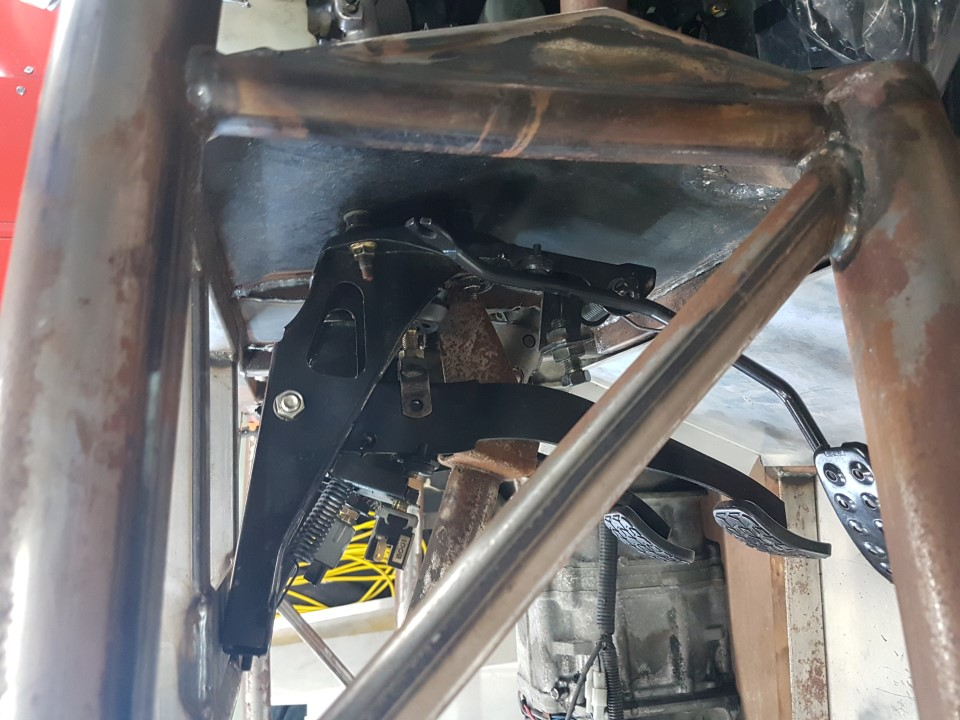
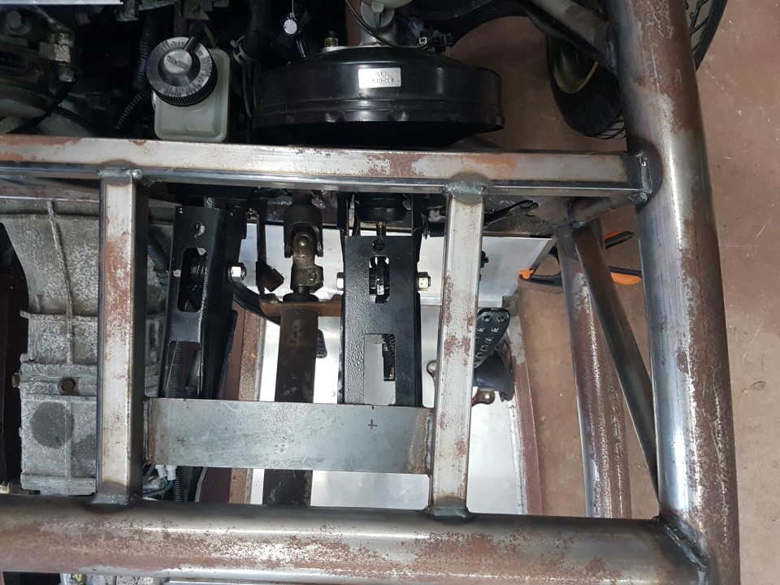

Pedal Box & steering
===

1.	On the back of the throttle/brake pedal box there are 4 spacers. These need to be cut so that the pedal box fit snugly against the firewall and the flat bar in the chassis above.
2.	Bolt the pedals in, brake reservoir has studs that the pedal box bolts to, note the gap so you can cut the spacers to make it fit correctly. 
3.	Although it varies a bit, generally cut half the top spacer off on a angle and add this to the bottom, from here you can tweak the spacers with the grinder or add some washers.
4.	Ensure the brake bias device and bracket have been removed, theres not enough clearance between this and the inlet.
5.	Knock out the studs on the clutch pedal box & cut off the spacers that use to go through the firewall. Grind flat.
6.	Use one of the longer studs to replace the shorter one the steering column fits to.
7.	Install a spacer you cut off (step 4) over the stud you just fitted.
8.	You may have to enlarge the hole on the chassis for the master cylinder (<1mm), their size changed a bit on some models.
9.	Bolt the clutch pedal in place utilising the master cylinder and 4x M8x40s with Nylocs and washers
10.	The steering shaft goes through the larger hole nearer the trans tunnel, this should fit over a stud on the clutch pedal and one on the brake pedal box.
11.	Using the steering top mount plate attach the top end of the steering wheel using M8x35 nylocs and washers. Note there is a high and low option here, we recommend the higher option for the preinstall, it holds things tighter together.
12.	Check all these bolts are tight and everything is sitting nicely with all pedals having full movement.
13.	Mark the plate above the pedals where the M10x25 bolts with nylocs and washers can go through.
14.	Punch & drill holes for top of pedal boxes.

