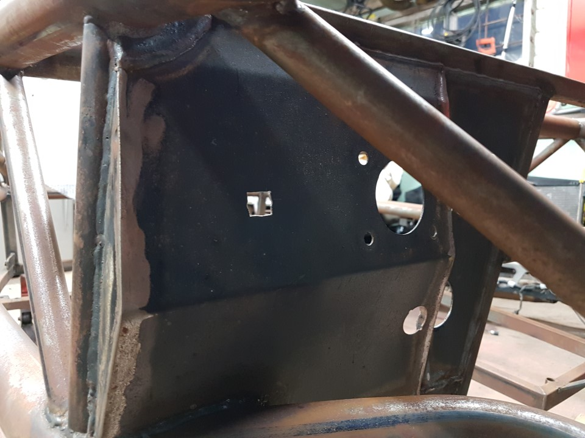

Working fit
===

1.	Fit the steering shaft into the steering rack, don't forget the rubber grommet that the shaft goes through to seal the firewall. Use a pry bar with some vice grips on, insert and twist to make this a bit easier, tighten all associated bolts and check clearances [LVV Standard 85-40(00) Section 2.2(16) cabin must be sealed from engine bay.]
a.	We found that the steering shaft sat too low in the hole with no further adjustment on the bolts. To fix this we cut the bolt slot and part of the bracket off, the welded it back on the outside. This allowed us to both move the steering column up and towards the passenger side.
2.	Ensure adequate spacing around master cylinders.
3.	Re fit the transmission tunnel - you will need to cut out a hole for the shift leaver. Use the shift leaver gator you will be using on the finished car to work out how big the hole can be. You will find the part of the gear lever housing protrudes above the trans tunnel line, make sure you allow a bit of movement from the rubber mounting, we cut a hole with 10mm clearance around the shift leaver.
4.	Mark where the throttle cable will penetrate the firewall, drill a 13mm hole and file to square, enlarge as required to allow the cable to snap in to place.

